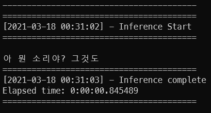

# Listen Attend And Spell
### (Pytorch Implementation using AIhub data)
#### Paper: https://arxiv.org/abs/1508.01211

----
한국어 음성인식 모델이 종합된 Kospeech의 경우 다양한 모델을 지원함에 따라 코드 복잡도가 높아 단순 모델 학습에는 용의하지 않습니다. 
그래서 본 git은 Kospeech의 모델 코드를 이용하여 몇몇 버그 수정 및 단순화에 집중하였습니다.

DeepSpeech -> **LAS**-> LAS(SpecAgument) -> Transformer -> Conformer -> RnnT순으로 추가예정입니다.

코드 사용을 허락해주신 Kospeech Author 김수환 님에게 감사드립니다.

Original git (Kospeech): https://github.com/sooftware/KoSpeech

### Kospeech Split project

-  DeepSpeech2: https://github.com/switiz/deepspeech2.pytorch

### Note
 - KospoonSpeech preprocess code import

--- 
### Step 1 PreProcess (추가예정)
preprocess 과정의 경우 KospoonSpeech방식을 그대로 이용하였기 때문에 아래 git의 코드를 이용하시면 됩니다.

https://github.com/sooftware/KoSpeech/tree/latest/dataset/kspon

### Step 2 Configuration
data/config.yaml 파일의 내용을 load하여 각 코드에서 사용하고 있기 때문에 custom이 필요시 config.yaml을 변경해주어야합니다.

특히 각각의 PC마다 dataset의 위치가 다르기 때문에 해당 부분을 주요하게 변경해주시면됩니다.

- root : dataset root 디렉토리
- script_data_path : script (kospeech style) 디렉토리
- vocab_path : kosponSpeech-preprocess로 생성된 vocab 파일

``` 
#traiin dataset
root : C:/SpeechRecognitionDataset/Dataset/AI_hub
script_data_path: C:/Users/sanma/PycharmProjects/las.pytorch/data/aihub/transcripts.txt
vocab_path: C:/Users/sanma/PycharmProjects/las.pytorch/data/aihub/aihub_labels.csv

#train
batch_size: 8
epochs: 5
use_cuda: True
cer_every: 500
teacher_forcing_step: 0.005
teacher_forcing_ratio: 0.99
min_teacher_forcing_ratio: 0.7
label_smoothing: 0.1

#model_save_load
resume: False
save_every: 1
#inference
inference: False
use_val_data: True
weight_path: C:/Users/sanma/PycharmProjects/las.pytorch/weights/pretrained.pt

#root : C:/SpeechRecognitionDataset/Dataset/AI_hub
#script_data_path: C:/Users/sanma/PycharmProjects/deepspeech2.pytorch/data/aihub/transcripts.txt
#vocab_path: C:/Users/sanma/PycharmProjects/deepspeech2.pytorch/data/aihub/aihub_labels.csv
#model_save_path: C:/Users/sanma/PycharmProjects/deepspeech2.pytorch/data/runs/train.pt

#validation
validation_every: 1

#input feature
feature: logmelspectrogram
n_mels : 40
use_npy: False
split_balance : 0.1

#ENCODER
encoder_hidden_dim : 256
encoder_bidirectional: True
encoder_rnn_type: LSTM
num_encoder_layers: 3
encoder_dropout_p: 0.1
mask_conv: False

#Decoder
decoder_max_length: 150
decoder_embedding_dim: 512
decoder_hidden_dim: 512
decoder_attn_mechanism: dot
decoder_num_heads: 4
decoder_num_layers: 2
decoder_rnn_type: LSTM
decoder_dropout_p: 0.3
decoder_bidirectional: False
decoder_use_beam: False
```

### Step 3 Train

```
python train.py
```

#### Resume
config.yaml의 resume을 True로 변경하거나 --resume arg를 넣어 동작시켜 줍니다.
가장 마지막모델을 기준으로 load하여 resume이 실행됩니다.

```
python train.py --resume
```

### Step 4 Inference
[pretrained weight](https://drive.google.com/file/d/1wb5E8ViS5WKv1P8ynVXaBb7VTdWVY0iU/view?usp=sharing)

inference.py를 실행하면 되며 현재는 validation data를 이용하여 inference하도록 되어있습니다.

```
python inference.py
```
특정 파일 inference를 위해서는 아래처럼 audio_path argment를 이용하면 됩니다.
```
python inference.py --audio_path 'audio_file'
```


### Step 5 Result
데이터셋 : AIHUB 1000h Korean speech data corpus

PC사양 : Windows10, AMD 3600, RAM32, RTX 3080, Pytorch 1.8

소요시간 : EPOCH당 8시간

Train Epoch : 5

CER : 0.40 (40%)

| LABEL                                    | PREDICT                                    |
|---------------------------------------------------|-------------------------------------------------|
| <sos>아 나도 그 생각을 해봤는데                              | 아 나도 그 생각을 해봤는데                                 |
| <sos>그런 게 있으면 우리 짝수여야 돼.                          | 그럼 일 주일 이 작 시야 돼.                               |
| <sos>그때.                                          | 그때.                                             |
| <sos>아 진짜? 근데 많이 생기지 않았을까? 이젠? 조금 뭐 이것저것 번화하고 있잖아 | 아 진짜? 근데 많이 생기지 않았을까? 이제? 두 분 뭐 이것저것 더 나가고 있잖아. |
| <sos>뭐라 그러지 그 등하원하는 버스가 없대. 그 유치원에 우리 동생네 이사 갔거든. | 뭐라고 이제 주 주나 하면은 버스 카페 그 주원에 우리 동생 얘기 상하거든.      |
| <sos>그래 놓고 공부 끝나니까 홀라당 가 버릴려구 하구.                 | 그러면 그 공부 끝나니까 돌려달라고?                            |
| <sos>그 누구 나오는데. 이름 약간 특이한 배우 말해봐.                 | 그쪽이다. 언니 이름이 약간 특이한 그 말고?                       |
| <sos>하나 둘이면 되지. 근데 하나는 외롭긴 외롭겠다.                  | 장사 두 개 보내지. 이 인정. 하나는 일 급 일 없겠다.                |
| <sos>그 온양 온천이 대전에 있는 거 아니야?                       | 그 오늘 언제 하는지 그 전에 있는 거 아니야?                      |
| <sos>똑바로 이제 발음을 이렇게 해보겠습니다.                       | 떡밥을 이케 팔아 먹을 게 그 먹을 순 있다고 하고 먹어 이거.             |
| <sos>쪼 쫌 더 친근한 건 없어?                              | 진짜 운동 친구랑 그렇게 싸.                                |
| <sos>영화표는 내가 살 테니깐 너가 팝콘 사.                       | 영화 보는 데가 솔직히 간 동화 타고 간 줄 알아?                    |
| <sos>아니 워낙 자유분방하니까 돌아다니는 거 좋아하고                   | 아 너무 너 자기도 너 하니까 공항에서 좋아하고.                     |
| <sos>근데 요즘 내가 그 후레쉬 빵 안 사준 거 같애.                  | 근데 요즘에 아 그 크리스마스 같은 거 돼?                        |
| <sos>어. 그 기 그 소리만 들어.                             | 야 그 기계 더 원인 안 돼.                                |
| <sos>왜 말을 안 해.                                    | 오 너 아는 언니                                       |
| <sos>안 갈 수도 있다며.                                  | 어 맛있겠다.                                         |
| <sos>그래.                                          | 그래.                                             |
| <sos>게임 뭐 하는데?                                    | 게임 뭐하는데?                                        |


### Reference

    @ARTICLE{2021-kospeech,
      author    = {Kim, Soohwan and Bae, Seyoung and Won, Cheolhwang},
      title     = {KoSpeech: Open-Source Toolkit for End-to-End Korean Speech Recognition},
      url       = {https://www.sciencedirect.com/science/article/pii/S2665963821000026},
      month     = {February},
      year      = {2021},
      publisher = {ELSEVIER},
      journal   = {SIMPAC},
      pages     = {Volume 7, 100054}
    }
